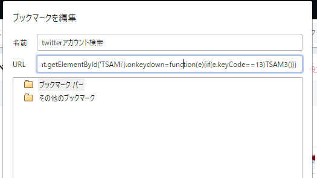

---
layout: default
title: Twitterのアカウント内検索MOD
---

PCブラウザ版Twitter(Twitter Web Client)で簡単にアカウント内検索できるブックマークレットです。
プロフィールページから2クリックでアカウント内検索を実現します。

## 使い方

使っているブラウザでブックマークを作成し、URLの欄に以下のコードをコピペしてください。名前は何でも構いません。

Twitterのプロフィールページ（自分のでなくても構いません）を表示した状態で、作成したブックマークをクリックする（ブックマークバーなどを表示しておいてください）と、「アカウント内検索」という検索窓が表示されます。

ページを移動したり更新したりすると消えてしまうので毎回ブックマークを開く必要はありますが、それでも今まで以上に簡単に検索することができるようになりました。

Google Chromeでのみ動作確認を行っております。また、導入は自己責任でお願いします。